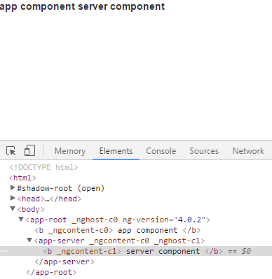
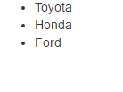
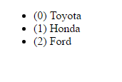
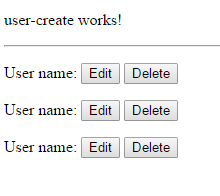
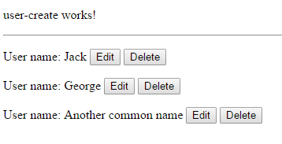

Angular 4 - Notes
====================


This repository is notes of my angular 4 journey. I couldn't switched to ng2. Now I decided to give a shot and getting course about ng4. I will write everthing that I learn, Maybe this repository guide you too.

Thanks [Maximilian Schwarzmuller](https://www.udemy.com/the-complete-guide-to-angular-2) for great guide.

Farewell my friend.


Index
----------------

- [Installation](#installation)
- [Creating project](#creating-project)
- [Serving project](#serving-project)
- [Investigating created project](#investigating-created-project)
- [Creating a new component](#creating-a-new-component)
- [Create component with cli](#create-component-with-cli)
- [Including bootstrap css to project](#including-bootstrap-css-to-project)
- [Databinding](#databinding)
- [Directives](#directives)
  - [ngIf](#ngif)
  - [ngFor](#ngfor)
  - [ngStyle](#ngstyle)
  - [ngClass](#ngclass)
  - [ngSwitch](#ngswitch)
- [Input](#input)
- [Output](#output)
- [View Encapsulation](#view-encapsulation)
- [Local Reference](#local-reference)
- [ng-content](#ng-content)
- [Life cycle of components](#life-cycle-of-components)
- [Creating a new directive](#creating-a-new-directive)
  - [HostListener](#hostlistener)
  - [HostBinding](#hostbinding)
- [Services and dependency injection](#services-and-dependency-injection)
  - [Injecting a service into another service](#injecting-a-service-into-another-service)
  - [Event emitting service](#event-emitting-service)
  
### Installation

To develop some applications we need to install node.js first. If you didn't know node.js, please check it before ng4. We will use angular cli. Angular cli will help us creating stuff. Its very useful tool.

```
npm i @angular/cli -g
```

We should install `@angular/cli` with global parameter. This parameter will use global node_modules folder rather than local one.

Now we can use `ng` command in terminal.


### Creating project

To create project we will use `ng` command. Try to type `ng` in terminal if you get error then you failed `Installation` step. Please go there and make sure you did this steps right.

ng command has some more arguments too. We will come to that but rightnow we just have to create a project so we should use `new` argument.

This argument will create a new project structure in current working directory. But we should give some project name to proceed. I will name the project as "my-first-app"

```
ng new my-first-app
```

After using this command in terminal some files will generated by `ng`. It will install necessary packages via npm. Wait until installation is done.


### Serving project

We just create a new project. Proceed to `my-first-app` folder. Use `serve` command of `ng`. It will do packaging stuff and create a http server.

```
cd my-first-app
ng serve
```

In terminal output, there should be a url address. If you can't figure the address then with `--port xxx` parameter, you can change port number to whatever you want.

```
ng serve --port 8080
```

Typescript compiled and Webpack packed your application.

Now try to access to [http://localhost:8080](http://localhost:8080)


### Investigating created project

> Before going deeper make sure you opened the project with an IDE software. I recommend Visual Studio Code or WebStorm..

In project folder we can see `e2e` folder, `src` folder, and some files. `e2e` folder contains end to end testing stuff. We will check it after. All our project source  stuff are in `src` folder. Other files contains information about configurations, required packages etc. We will check them when we need.

Inside of `src` folder there are multiple files. The most important file in this folder is `index.html` file. This file is the highest point of our project. If you open it you will see something like this.

```html
<!doctype html>
<html>
<head>
    <meta charset="utf-8">
    <title>MyFirstApp</title>
    <meta name="viewport" content="width=device-width, initial-scale=1">
    <link rel="icon" type="image/x-icon" href="favicon.ico">
</head>
<body>
    <app-root>Loading...</app-root>
</body>
</html>
```

In side of body element we have special tag which aren't in html standard. Its `app-root` element.

If you check `app` folder. Go dive into `app.component.ts` file. 

```ts
import { Component } from '@angular/core';

@Component({
  selector: 'app-root',
  templateUrl: './app.component.html',
  styleUrls: ['./app.component.css']
})
export class AppComponent {
}
```

As you can see there is some property `selector` is setted to `app-root`. In angular components will bind to element that given as `selector`. Selector is kinda like css element selector. If you use `name` then you will select `tag`, if you use `.name` then you will select `class`, if you use `[name]` you will select `property`.

`templateUrl` property routes component's template location. You can use `template` property too if you don't want to create html file.

```ts
import { Component } from '@angular/core';

@Component({
  selector: 'app-root',
  template: `
    <b>hi</b>
  `,
  styleUrls: ['./app.component.css']
})
export class AppComponent {
}
```

`styleUrls` property shows us component's css file location. You can use `styles` too if you don't want to create css file. Difference between `template` and `styles`, styles is expecting an array of string, not directly string.

```ts
import { Component } from '@angular/core';

@Component({
  selector: 'app-root',
  template: `
    <b>hi</b>
  `,
  styles: [
      `b {
          color: red;
      }`
  ]
})
export class AppComponent {
}
```

`app.component.spec.ts` file contains information about tests. We will ignore it just for now. 

In angular projects works under modules. These modules look like `java packages` or `c# namespaces`. Your components defined in a module. `app.module.ts` file contains our main module. 

```ts
import { BrowserModule } from '@angular/platform-browser';
import { NgModule } from '@angular/core';
import { FormsModule } from '@angular/forms';
import { HttpModule } from '@angular/http';

import { AppComponent } from './app.component';

@NgModule({
  declarations: [
    AppComponent
  ],
  imports: [
    BrowserModule,
    FormsModule,
    HttpModule
  ],
  providers: [],
  bootstrap: [AppComponent]
})
export class AppModule { }
```

All components that using in this project should declared in this file. If we don't declare it, angular couldn't find component that we want to use. 

Rightnow I won't explain other files that we didn't check. We will come to them too.

> Before going deeper I recommend to learn typescript. If you don't have a clue about it please check it.


### Creating a new component

To create new component; first create a folder inside of `./src/app/` folder. We name it `server`.

Inside of this folder create a file that called `server.component.ts`. Also you may create `server.component.html` too.

In server.component.ts;

```ts
export class ServerComponent {

}
```

We created a class that named `ServerComponent`. This class should exported out. We can't use if we didn't export it. we still have to do some stuff. We have to create a `decorator` that decorates this class is a `Component`. So lets do it?

```ts
@Component({

})
export class ServerComponent {

}
```

But it won't compile. We have to import something.. `Component` decorator is defined in `@angular/core` package. We can import it from this package by like this.

```ts
import { Component } from '@angular/core';

@Component({

})
export class ServerComponent {

}
```

Now we created a component that angular could use. But still it is invalid. Because it's like untitled subject. It just there but no one could call it. So we have to declare some `selector`.

```ts
import { Component } from '@angular/core';

@Component({
  selector: 'app-server'
})
export class ServerComponent {

}
```

`selector` is similiar to css selector. If you just put something in there like this `app-server`; it would look for `<app-server></app-server>`. If you put there `.app-server` then you get `<div class="app-server"></div>`. You can even use `[app-server]` to look for properties. (like `<div app-server></div>`).


We have to bind component's html file to component itself. We can use `templateUrl`. It is same as `app.component`.

```ts
import {Component} from '@angular/core';

@Component({
  selector: 'app-server',
  templateUrl: './server.component.html'
})
export class ServerComponent {

}
```

To use this component we have to add it to `app.module.ts`.


```ts
import { BrowserModule } from '@angular/platform-browser';
import { NgModule } from '@angular/core';
import { FormsModule } from '@angular/forms';
import { HttpModule } from '@angular/http';

import { AppComponent } from './app.component';
import { ServerComponent } from './server/server.component' // <<-- import first

@NgModule({
  declarations: [
    AppComponent,
    ServerComponent // <<-- we have to add component here
  ],
  imports: [
    BrowserModule,
    FormsModule,
    HttpModule
  ],
  providers: [],
  bootstrap: [AppComponent]
})
export class AppModule { }

```

I will change `server.component.html`

```html
<b> server component </b>
```

Now we can use this component. Create a new element in `app.component.html`. 

```html
<b> app component </b>

<app-server></app-server>
```

Check out [http://localhost:8080](http://localhost:8080) now.



### Create component with cli

Sometimes we don't want to create basic structures over and over again. So `@angular/cli` has a solution. Using generate function of `ng` we can create components without any labor.

```
ng generate component <name>
or
ng g c <name>
```

for example, If we want to create servers component then;

```
ng generate component servers
```

Will generate `servers` folder in `app` folder and It will create `ts`, `html`, `css` and `.spec.ts` files automaticly. Also it will add declaration to `app.module.ts`. Basically it makes component ready to use.


### Including bootstrap css to project

We may need bootstrap for our project. How we import it? First we have to download the package.

```
npm install bootstrap --save
```

Then open the `.angular-cli.json` file. Modify it like this;

```js
{
  "$schema": "./node_modules/@angular/cli/lib/config/schema.json",
  "project": {
    "version": "1.0.0-beta.32.3",
    "name": "new-cli"
  },
  "apps": [
    {
      "root": "src",
      "outDir": "dist",
      "assets": [
        "assets",
        "favicon.ico"
      ],
      "index": "index.html",
      "main": "main.ts",
      "polyfills": "polyfills.ts",
      "test": "test.ts",
      "tsconfig": "tsconfig.json",
      "prefix": "app",
      "styles": [
        "../node_modules/bootstrap/dist/css/bootstrap.min.css", // <<-- we add this line
        "styles.css"
      ],
      "scripts": [],
      "environmentSource": "environments/environment.ts",
      "environments": {
        "dev": "environments/environment.ts",
        "prod": "environments/environment.prod.ts"
      }
    }
  ],
  "e2e": {
    "protractor": {
      "config": "./protractor.conf.js"
    }
  },
  "lint": [
    {
      "files": "src/**/*.ts",
      "project": "src/tsconfig.json"
    },
    {
      "files": "e2e/**/*.ts",
      "project": "e2e/tsconfig.json"
    }
  ],
  "test": {
    "karma": {
      "config": "./karma.conf.js"
    }
  },
  "defaults": {
    "styleExt": "css",
    "component": {}
  }
}

```

Now you can use bootstrap. 

>**Note:** There is a library for [bootstrap](https://github.com/ng-bootstrap/ng-bootstrap). It basically provides components too.


### Databinding

Databinding is basically binding datas between template and class.

* **OUT** String Interpolation: Bind a variable to template. Syntax `{{ data }}`
* **OUT** Property Binding: Bind a variable to template's property. Syntax `[property]="data"`
* **IN** Event Binding: Bind a event to class. Syntax `(event)="expression"`

#### String Interpolation

Lets a create basic component that writes a name. Name should provided with String Interpolation from a variable that we define in class.

```ts
import { Component } from '@angular/core';

@Component({
  selector: 'app-name',
  template: `
    <p> My name is {{name}} </p>
  `
})
export class NameComponent {
  name: string = "Doğan";
}
```

Output:


This time lets add a 1 second timeout. After 1 second we will change the name to "Göksel"

```ts
import { Component } from '@angular/core';

@Component({
  selector: 'app-name',
  template: `
    <p> My name is {{name}} </p>
  `
})
export class NameComponent {
  name: string = "Doğan";

  constructor() {
    setTimeout(() => {
      this.name = "Göksel";
    }, 1000);
  }
}
```

In the beginning it will show you ` My name is Doğan ` but after 1 second you will get ` My name is Göksel `. Databinding makes template render again. So you don't care rendering mechanism. 

#### Property binding and Event Binding

This time we will use other binding types too.

```ts
import { Component } from '@angular/core';

@Component({
  selector: 'app-name',
  template: `
    <button [disabled]="isDisabled" (click)="someAction()">Regular button</button>
    <button (click)="changeDisabled()"> {{isDisabled}} </button>
  `
})
export class NameComponent {
  isDisabled = true;

  someAction() {
    alert("hello");
  }

  changeDisabled() {
    this.isDisabled = !this.isDisabled; // reverse the value
  }
}
```

At the beginning regular button isn't clickable. But when we click second button it will be enabled and you get alert "hello" when you click it.

#### Two way databinding

There is one more databinding type of angular. Its called `Two way databinding`. This time events, properties and classes binded.


```ts
import { Component } from '@angular/core';

@Component({
  selector: 'app-name',
  template: `
    <input [(ngModel)]="name"> 
    
    <p> My name is {{name}} </p>
  `
})
export class NameComponent {
  name: string = "Doğan";
}
```

You will see that when input change class's name will automaticly change and then `My name is ____` will automaticly render back. If you change name from class then input's value will change too.

> **Note:** `ngModel` should be imported in `app.module.ts` file. Required module is `FormsModule`.

### Directives

There are 3 kinds of directives.

* Components
* Structural Directives (you will see this as star `*` character)
* Attribute Directives

You already know the components. Lets dive into structural directives.

These directives are control full of dom. You may ask why?

#### ngIf

Lets check an example of `*ngIf`


```ts
import { Component } from '@angular/core';

@Component({
  selector: 'app-name',
  template: `
    <button (click)="visible = !visible">{{visible}}</button>
    <p *ngIf="visible">
      I'm visible now
    </p>
  `
})
export class NameComponent {
  visible: boolean = false;
}
```

In this example when you click the button, some text appears. But interesting part is when visible is false, p element won't exist. It will be created when visible is true. Structural directives modify current dom and remove.

You can use else syntax (Angular 4) too.


```ts
import { Component } from '@angular/core';

@Component({
  selector: 'app-name',
  template: `
    <button (click)="visible = !visible">{{visible}}</button>
    <p *ngIf="visible; else hidden">
      I'm visible now
    </p>
    <ng-template #hidden>
      <p>
        I'm hidden
      </p>
    </ng-template>

  `
})
export class NameComponent {
  visible: boolean = false;
}
```

Please try it before continue.

#### ngFor

ngFor is a structural directive too. It will modify and clone itself as given array. For example;

```ts
import { Component } from '@angular/core';

@Component({
  selector: 'app-name',
  template: `
    <ul>
      <li *ngFor="let car of cars">{{car}}</li>
    </ul>
  `
})
export class NameComponent {
  cars = [
    'Toyota',
    'Honda',
    'Ford'
  ]
}
```



ngFor also has a index syntax. If you use a `;` character then define a variable that equals the index; you can use the index in the scope.

```ts
import { Component } from '@angular/core';

@Component({
  selector: 'app-name',
  template: `
    <ul>
      <li *ngFor="let car of cars; let i = index">({{i}}) {{car}}</li>
    </ul>
  `
})
export class NameComponent {
  cars = [
    'Toyota',
    'Honda',
    'Ford'
  ]
}
```




#### ngStyle

ngStyle is an attribute directive. It doesn't like structural directives.

```ts
import { Component } from '@angular/core';

@Component({
  selector: 'app-name',
  template: `
    <ul>
      <li *ngFor="let car of cars" [ngStyle]="{backgroundColor: car.total > 0 ? 'green' : 'red'}">{{car.name}}</li>
    </ul>
  `
})
export class NameComponent {
  cars = [
    {
      name: 'Toyota',
      total: 1
    },
    {
      name: 'Ford',
      total: 0
    }
  ]
}
```

You will see that Toyota item will green but Ford item will red.

#### ngClass

ngClass is an attribute directive too.

```ts
import { Component } from '@angular/core';

@Component({
  selector: 'app-name',
  template: `
    <ul>
      <li *ngFor="let car of cars" [ngClass]="{notInStock: car.total == 0}">{{car.name}}</li>
    </ul>
  `,

  styles: [
    `.notInStock {
      background-color: red
    }`
  ]
})
export class NameComponent {
  cars = [
    {
      name: 'Toyota',
      total: 1
    },
    {
      name: 'Ford',
      total: 0
    },
  ]
}
```

You will see that Toyota item will looking normal but Ford item will be red.

#### ngSwitch

ngSwitch is for switching between multiple cases. Its very usefull built-in directive.

```ts
import { Component } from '@angular/core';

@Component({
  selector: 'app-name',
  template: `
    <div [ngSwitch]="count">
      <p *ngSwitchCase="5"> Count is 5 </p>
      <p *ngSwitchCase="10"> Count is 10 </p>
      <p *ngSwitchDefault> Count is Default </p>
    </div>
  `
})
export class NameComponent {
  count: number = 5;
}
```


### Input

In this chapter our goal is making some property to accessible from outside. You may ask why we need this? We creating components that has own scope. For example we create "create new user" component and  "user list" component. So one component must effect to another one. 

First lets do what we wanted. We will create some components.

```bash
ng new my-second-app
cd my-second-app
ng g c users --spec false    #-- spec false blocks spec file generation
ng g c users/user-list --spec false # users/list syntax will create a component in users folder. 
ng g c users/user-item --spec false
ng g c users/user-create --spec false
```

Edit app.component.html as this

```html
<app-users></app-users>
```


Edit users.component.html as this

```html
<app-user-create></app-user-create>
<hr>
<app-user-list></app-user-list>
```

Add an array to user-list component file.

```ts
import { Component, OnInit } from '@angular/core';

@Component({
  selector: 'app-user-list',
  templateUrl: './user-list.component.html',
  styleUrls: ['./user-list.component.css']
})
export class UserListComponent implements OnInit {
  users = ['Jack', 'George', 'Another common name']; // << this line
  
  constructor() { }

  ngOnInit() {
  }
}
```

Edit user-list.component.html as this

```html
<app-user-item *ngFor="let user of users"></app-user-item>
```

Edit user-item.component.html and user-item.component.ts as like this.

```html
<p>
  User name: {{name}} 
  <button>Edit</button>
  <button>Delete</button>
</p>
```

```ts
import { Component, OnInit } from '@angular/core';

@Component({
  selector: 'app-user-item',
  templateUrl: './user-item.component.html',
  styleUrls: ['./user-item.component.css']
})
export class UserItemComponent implements OnInit {
  name: string;
  constructor() { }

  ngOnInit() {
  }

}
```

So now we ready to process. If you get this point you probably see this screen.



User fields are created but name seems doesn't work at all. We have to do something don't we. UserItemComponent element's name property cannot be accessed by other component because it works in own closure. We have to add a decorator to access. Its called `@Input`

We now editing user.component.ts 


```ts
import { Component, OnInit } from '@angular/core';

@Component({
  selector: 'app-user-item',
  templateUrl: './user-item.component.html',
  styleUrls: ['./user-item.component.css']
})
export class UserItemComponent implements OnInit {
  @Input() name: string;
  constructor() { }

  ngOnInit() {
  }

}
```

`@Input` decorator is actually decorator generating function. So we have to call it like `@Input()`. You can use the first parameter as alias. I will give you an example for it too.

Now we test our application but result is same. Nothing changed :worried:


We forgot to set name because we never set it or access it from outside of user-item component. 

Edit the user-list.component.html

```html
<app-user-item *ngFor="let user of users" [name]="user"></app-user-item>
```

As you can see, we used a property binding. Basically `@Input` working as property. We set the value as user, because we declared a variable as `user` in ngFor directive.

Now give a shot. 



Lets check example of the alias parameter `@Input()`. 

app-user-item.ts

```ts
import { Component, OnInit } from '@angular/core';

@Component({
  selector: 'app-user-item',
  templateUrl: './user-item.component.html',
  styleUrls: ['./user-item.component.css']
})
export class UserItemComponent implements OnInit {
  @Input('user') name: string; // << as you can see we give some parameter 
  constructor() { }

  ngOnInit() {
  }

}
```

Now component looking for `user` property. 


Edit the user-list.component.html

```html
<app-user-item *ngFor="let user of users" [user]="user"></app-user-item>
```

### Output

Last chapter we dive into Input. In our example we created edit and delete buttons. Also we must have a working user-create component too. Lets check it.

user-create.component.html

```html
name: <input type="text" [(ngModel)]="name">
<button (click)="onUserCreate()">create</button>
```

user-create.component.ts

```ts
import { Component, OnInit, Output, EventEmitter } from '@angular/core';

@Component({
  selector: 'app-user-create',
  templateUrl: './user-create.component.html',
  styleUrls: ['./user-create.component.css']
})
export class UserCreateComponent implements OnInit {

  constructor() { }

  ngOnInit() {
  }

  name: string; // two-way-binding property

  @Output()
  onUserCreated = new EventEmitter<string>(); // this is the our event that can be binded out of this component
  // note: EventEmitter should be imported from @angular/core

  onUserCreate() { // this function get trigger when user click button
    this.onUserCreated.emit(this.name);  // we send data to eventemitter
  }
}
```

> **Note:** I will move users to upper component.

users.component.html

```html
<app-user-create (onUserCreated)="onUserCreated($event)"></app-user-create>
<hr>
<app-user-list [users]="users"></app-user-list>
```

users.component.ts

```ts
import { Component, OnInit } from '@angular/core';

@Component({
  selector: 'app-users',
  templateUrl: './users.component.html',
  styleUrls: ['./users.component.css']
})
export class UsersComponent implements OnInit {
  users = ['Jack', 'George', 'Another common name'];

  constructor() { }

  ngOnInit() {
  }

  onUserCreated(name) {
    this.users.push(name);
  }
}
```

user-list.component.ts

```ts
import { Component, OnInit, Input } from '@angular/core';

@Component({
  selector: 'app-user-list',
  templateUrl: './user-list.component.html',
  styleUrls: ['./user-list.component.css']
})
export class UserListComponent implements OnInit {
  @Input() // added this
  users; 
  
  constructor() { }

  ngOnInit() {
  }

}
```

Lets check our application. We type some name to input. Then click the create button. :sunglasses:

### View Encapsulation

Component's css files are specific to component. For example in css file;

```css
b {
  color: red;
}
```

This css compiled with some property selector so this way other components b element won't get any effect but you may don't want to do that. Simply changing encapsulation can modify this feature.

```ts
import { Component, ViewEncapsulation } from '@angular/core';

@Component({
  selector: 'app-some',
  templateUrl: './some.component.html',
  styleUrls: ['./some.component.css'],
  encapsulation: ViewEncapsulation.None
})
export class SomeComponent {

}
```

### Local reference

Local reference makes a marking for DOM elements. We use that in `*ngIf` structure directive section. There is one more thing that I should write and thats named `@ViewChild` decorator.

This decorator allows to access DOM element from code. If you know what are you going to do then you can use this decorator, otherwise please avoid using this feature.

```ts
import { Component, ViewChild, ElementRef } from '@angular/core';

@Component({
  selector: 'app-some',
  template: `
  <div #localReference>

  </div>
  `
})
export class SomeComponent {
  @ViewChild('localReference') 
  localReferenceDiv: ElementRef;
}
```


### ng-content

ng-content is a special directive that provide element's content. Normally angular will override the content of components. `<app-root>Loading...</app-root>` is good example for this consept. When angular handle `app-root` then `Loading` text will disapear. But what if we want it. 

Let me show you an example.

```ts
import { Component } from '@angular/core';

@Component({
  selector: 'app-bold',
  template: `
    <b>
      <ng-content></ng-content> <!-- all content will goes to this -->
    </b>
  `
})
export class BoldComponent {
}
```

```ts
import { Component } from '@angular/core';

@Component({
  selector: 'app-root',
  template: `
    <app-bold> this text will be bold </app-bold>
  `
})
export class AppComponent {
}
```

> **Note:** Last chapter we learnt ViewChild. If you want to use ViewChild in a content it won't work. You have to use `@ContentChild`

### Life cycle of components

Components have a standard life cycle. They all have these things. We can hook them.

* ngOnChanges: Called after a bound input proerty changes
* ngOnInit: Called once the component initalized
* ngDoCheck: Called during every change detection run
* ngAfterContentInit: Called after content (ng-content) has been projected into view
* ngAfterContentChecked: Called every time the projected content has been checked
* ngAfterViewInit: Called after the component's view (and child views) has been initalized.
* ngAfterViewChecked: Called every time the view (and child views) has been checked.
* ngOnDestroy: Called once the components is about the be destroyed.

```ts
import { Component, OnInit, OnChanges, SimpleChanges, DoCheck, AfterContentInit, AfterContentChecked, AfterViewInit, AfterViewChecked, OnDestroy } from '@angular/core';

@Component({
  selector: 'app-some',
  template: ` `
})
export class SomeComponent implements OnInit, OnChanges, DoCheck, AfterContentInit, AfterContentChecked, AfterViewInit, AfterViewChecked, OnDestroy {

    ngOnChanges(changes: SimpleChanges): void {
    console.log('ngOnChanges', changes);
  }

  ngOnInit(): void {
    console.log('ngOnInit');
  }

  ngDoCheck(): void {
    console.log('ngDoCheck');
  }

  ngAfterContentInit(): void {
    console.log('ngAfterContentInit');
  }

  ngAfterContentChecked(): void {
    console.log('ngAfterContentChecked');
  }

  ngAfterViewChecked(): void {
    console.log('ngAfterViewChecked');
  }

  ngAfterViewInit(): void {
    console.log('ngAfterViewInit');
  }

  ngOnDestroy(): void {
    console.log('ngOnDestroy');
  }
}
```


### Creating a new directive

We saw some already defined directives. But how we can defire new? This chapter we will dive into that.

Directives are defining just like components. You have to add them to app.module.ts. We can create manual but I will use @angular/cli.

```
ng generate directive <name>
or
ng g d <name>
```

I will create a green directive that makes elements green on hover.

```
ng g d green
```

I remove spec.ts file because we don't care tests just now. There should be green.directive.ts file. Directive files are created as `<name>.directive.ts` syntax. 

```ts
import { Directive } from '@angular/core';

@Directive({
  selector: '[appGreen]'
})
export class GreenDirective {
  constructor() { }
}
```

This directive will handle the `appGreen` property. If you use somewhere else this then directive will bound to element.

#### HostListener

We trying to make green element whenever mouse hover's the element so we have to catch the events.

```ts
import { Directive, HostListener } from '@angular/core';

@Directive({
  selector: '[appGreen]'
})
export class GreenDirective {
  constructor() { }

  @HostListener('mouseenter')
  mouseenter() {
    // mouse enters
  }

  @HostListener('mouseleave')
  mouseleave() {
    // mouse leaves
  }
}
```

#### HostBinding

How about to change colors? Now we use `@HostBinding`.

```ts
import { Directive, HostBinding, HostListener } from '@angular/core';

@Directive({
  selector: '[appGreen]'
})
export class GreenDirective {
  @HostBinding('style.backgroundColor') backgroundColor: string = 'transparent';

  @HostListener('mouseenter')
  mouseenter() {
    this.backgroundColor = 'green';
  }

  @HostListener('mouseleave')
  mouseleave() {
    this.backgroundColor = 'transparent';
  }
}
```

### Services and dependency injection

Services useful to carry data between components. We do not require any decorator to create service. Lets create an user service.

I recommend to create file as `<name>.service.ts` syntax. 

So lets create a new users.service.ts file on `app` folder.

```ts
export class UserService {
  users = [
    {id: 1, name: 'co3moz'},
    {id: 2, name: 'goxel'}
    {id: 3, name: 'Ilrkhoaktul'}
  ]

  getUsers() {
    return this.users;
  }

  addUser(user: {id: number, name: string}) {
    this.users.push(user);
  }

  removeUser(id: number) {
    this.users.splice(id, 1);
  }
}
```

We basically create an users service class with some property and functions.

Lets use it from a component.

```ts
import { UserService } from 'user.service';
import { Component } from '@angular/core';

@Component({
  selector: 'app-user-list',
  template: `
    <p *ngFor="let user of users"> {{ user.name }} </p>
  `,
  providers: [
    UserService
  ]
})
export class UserListComponent implements OnInit {
  users;
  constructor(private userService: UserService) {} // userService's type must be declared. Otherwise it won't work.

  ngOnInit() {
    this.users = this.userService.getUsers(); // pass reference of array to local variable.
  }
}
```

> **Important Note** providers will provide a service to component but every creation of userlistComponent will make own UserService. Because we said to component when you initializing create a new service that called UserService. But what if we just want to application wide? We may need to use this datas from outside of this component. We have to use app.module.ts file for this job. Inside of app.module.ts there is providers section that we can put our service. 

> **Important Note 2** Children of userListComponent can access same service if they didn't declared a new provider of UserService. So Providers section of component should be used only for creating new provider.

You can use @angular/cli to generate service

```
ng generate service <name>
or
ng g s <name>
```

#### Injecting a service into another service

We may need a service inside of another service. For example we may have a logging service and this service may required to other places. So how we use another service in our service?

There you go some example of `@Injectable`

```ts
import { LoggingService } from 'logging.service';
import { Injectable } from '@angular/core';

@Injectable()
export class UserService {
  users = [
    {id: 1, name: 'co3moz'},
    {id: 2, name: 'goxel'}
    {id: 3, name: 'Ilrkhoaktul'}
  ];

  constructor(private loggingService: LoggingService) {

  }

  getUsers() {
    return this.users;
  }

  addUser(user: {id: number, name: string}) {
    this.users.push(user);
    this.loggingService.log('user added');
  }

  removeUser(id: number) {
    this.users.splice(id, 1);
    this.loggingService.log('user removed');
  }
}
```


#### Event emitting service

We may need a event that emits some information that happened somewhere else and collect required data to show another component. This is how you can do that.

```ts
import { LoggingService } from 'logging.service';
import { Injectable, EventEmitter } from '@angular/core';

@Injectable()
export class UserService {
  users = [
    {id: 1, name: 'co3moz'},
    {id: 2, name: 'goxel'}
    {id: 3, name: 'Ilrkhoaktul'}
  ];

  constructor(private loggingService: LoggingService) {

  }

  userCreated = new EventEmitter<{id: number, name: string}>();

  getUsers() {
    return this.users;
  }

  addUser(user: {id: number, name: string}) {
    this.users.push(user);
    this.userCreated.emit(user);
    this.loggingService.log('user added');
  }

  removeUser(id: number) {
    this.users.splice(id, 1);
    this.loggingService.log('user removed');
  }
}
```

In component we can just subscribe the event. We will learn better feature so this feature is just for knowledge.

```ts
import { UserService } from 'user.service';
import { Component } from '@angular/core';

@Component({
  selector: 'app-user-list',
  template: `
    <p *ngFor="let user of users"> {{ user.name }} </p>
  `,
  providers: [
    UserService
  ]
})
export class UserListComponent implements OnInit {
  users;
  constructor(private userService: UserService) {
    this.userService.userCreated.subscribe((user) => {
      console.log('new user just created');
    });
  } // userService's type must be declared. Otherwise it won't work.

  ngOnInit() {
    this.users = this.userService.getUsers(); // pass reference of array to local variable.
  }
}
```